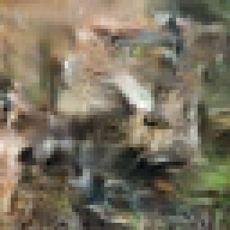
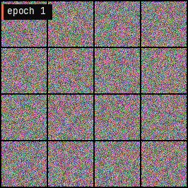
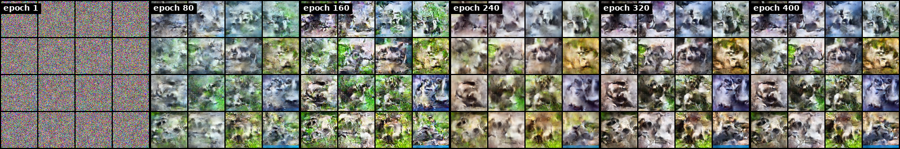
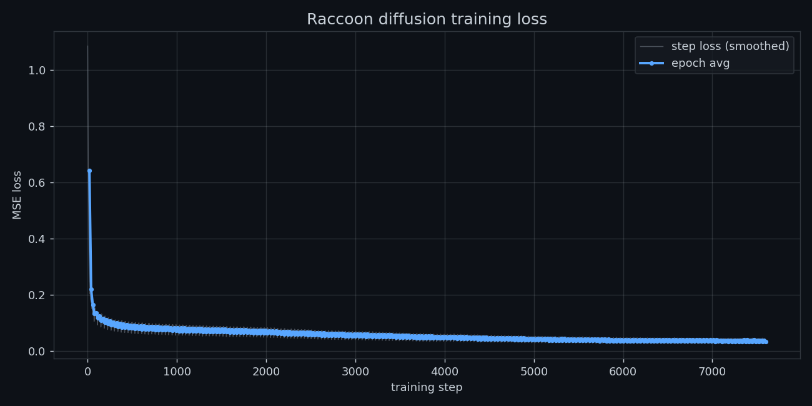
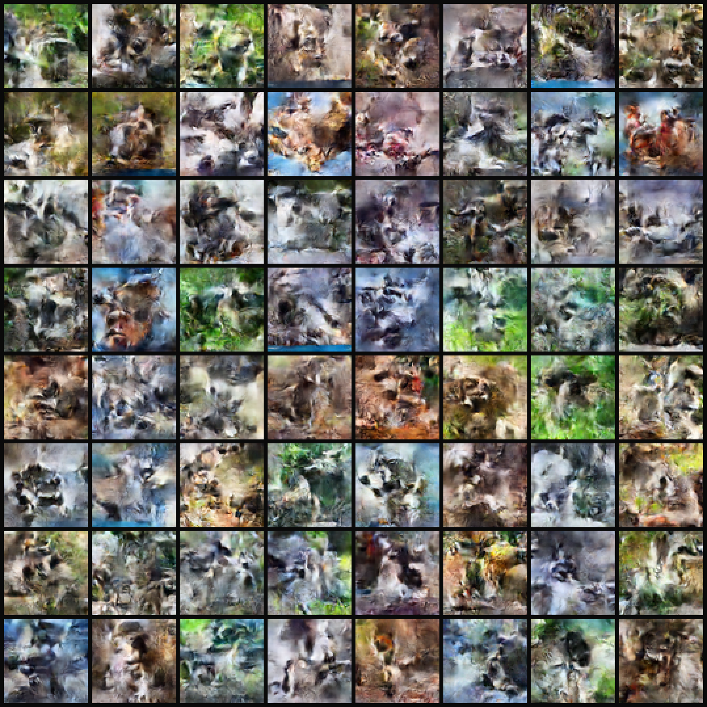
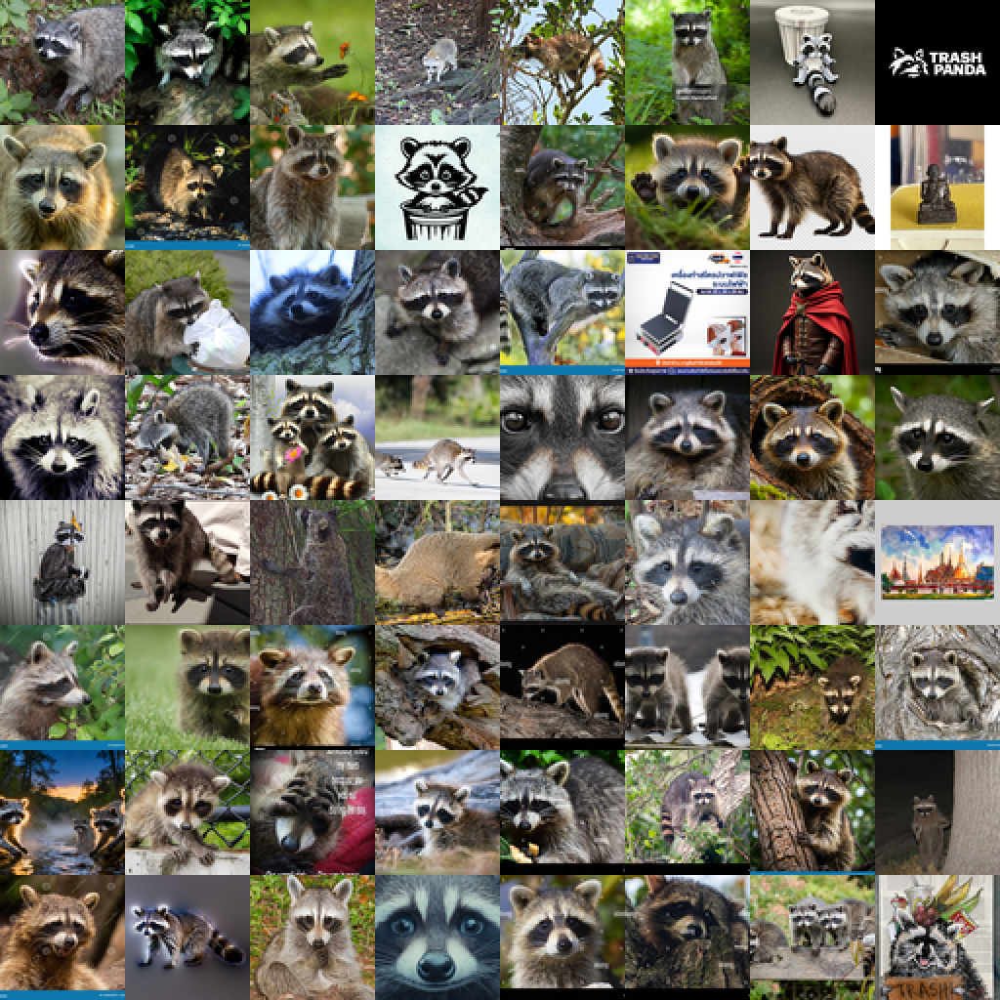

# Raccoon Diffusion

A tiny DDPM that generates 64×64 raccoons, seeded by your git commit history.
Trains in well under an hour on a single GPU.

<p align="center">
  
</p>

## What's inside

- ~8M-parameter U-Net with self-attention at 16×16 and 8×8
- Cosine β-schedule, DDPM training, DDIM sampling (50 steps)
- EMA weights with warmup for cleaner samples
- Mixed-precision training (CUDA)
- Deterministic generation: same seed → same raccoon

## The model learning to draw raccoons

Same noise seed every epoch — what changes is the network. Pure noise becomes
furry mask-faced bandits over a few hundred epochs.

<p align="center">
  
</p>

A static side-by-side at six checkpoints:



## The denoising trajectory

A single fixed noise tensor, iteratively denoised with DDIM. You can watch the
raccoons literally crystallize out of static.

<p align="center">
  
</p>

## Training loss

Cosine-schedule MSE loss on noise prediction, ~7,600 steps total.



## A grid of fresh raccoons

64 raccoons from the trained EMA model, each with a different seed:

<p align="center">
  
</p>

## Interactive demos (for the blog post)

The static images above are also produced as JSON dumps + standalone HTML
viewers under `assets/interactive/`, designed to be iframed into a blog post:

- **`trajectory.html`** — scrub through every DDIM step, watch a single
  raccoon crystallize out of static
- **`epochs.html`** — drag a slider through every training epoch checkpoint
- **`seeds.html`** — click a 64-cell grid of raccoons, zoom on any seed
- **`interp.html`** — slerp between two seeds, watching one raccoon morph
  into another
- **`inference.html`** — runs the *model itself* in your browser via
  onnxruntime-web; type a seed, get a fresh raccoon (no server)

Build them after training:

```bash
python build_interactive.py        # writes the JSON + html viewers
python export_onnx.py              # writes raccoon_unet.onnx for the live demo
```

## What was in the training set

684 raccoon photos scraped from the web (DuckDuckGo image search), center-cropped
to 64×64. A few logos and illustrations slipped through — see the corners of the
preview — but the long tail of furry photos dominates the gradient.

<p align="center">
  
</p>

## Quick start

```bash
pip install -r requirements.txt

# 1. Pull a raccoon dataset (uses DuckDuckGo image search)
python prepare_data.py --download --num_images 800

# 2. Train (RTX 4080: ~25 min for 400 epochs)
python train.py --data_dir ./raccoon_data --epochs 400 --batch_size 64

# 3. Make all the visualizations in this README
python visualize.py

# 4. Generate a single raccoon seeded by your git history
python generate_raccoon.py
```

Useful training knobs:

| flag              | default  | what it does                                                |
|-------------------|----------|-------------------------------------------------------------|
| `--epochs`        | 300      | how long to train                                           |
| `--batch_size`    | 64       | bump down to 32 if you OOM                                  |
| `--lr`            | 2e-4     | AdamW with cosine decay                                     |
| `--schedule`      | cosine   | `cosine` or `linear` β-schedule                             |
| `--sample_every`  | 1        | save a sample grid every N epochs (used by the evolution gif) |
| `--ema_decay`     | 0.9995   | cap of the EMA decay (warms up over the first ~1000 steps)  |

## Architecture

A U-Net with 4 spatial levels:

```
64×64 ─┐
       ├─► encoder ─► 32×32 (128c) ─► 16×16 (256c, attn) ─► 8×8 (256c, attn)
                                                                  │
                                       bottleneck 4×4 (256c, attn) ◄┘
                                                                  │
       ◄─ decoder ◄─ 32×32 ◄─ 16×16 (attn) ◄─ 8×8 (attn) ◄───────┘
64×64 ◄┘
```

- ~8M parameters
- Time embedding via sinusoidal encoding + 2-layer MLP, injected at each conv block
- Self-attention applied at the two coarsest non-bottleneck levels

## How the seed works

`generate_raccoon.py` reads every commit SHA in the repo, mashes them together
with today's date, hashes that to a 32-bit int, and uses it as `torch.manual_seed`
before sampling from pure noise. So:

- same commits + same day → same raccoon
- new commit → new raccoon
- new day → new raccoon

See [TRAINING.md](TRAINING.md) for a deeper walkthrough of the training loop.

## License

MIT
